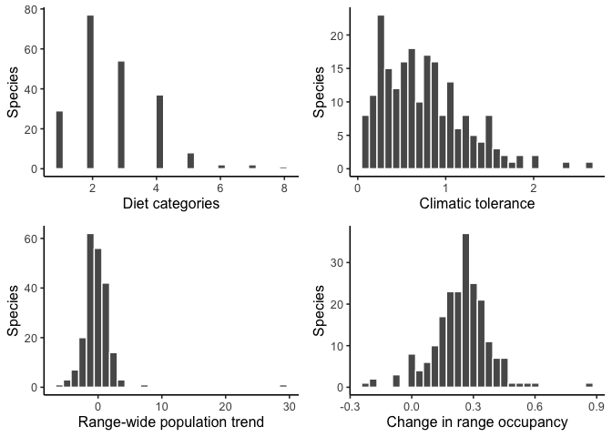

SEM final
================
Grace Di Cecco
11/19/2020

## Structural equation modeling of species range changes

#### Data sources

For my project, I decided to build an SEM examining whether species’
niche breadths along multiple niche axes predicts shifts in their
range-wide population size and range occupancy from 1970 to the present
in North American breeding birds. To do this, I obtained data on the
trend in population and change in range occupancy (the difference in the
proportion of occupied survey locations from 2012-2017 and 1970-1975)
from the North American Breeding Bird Survey for species that occurred
on greater than 100 BBS survey routes throughout the study time period
(<https://www.pwrc.usgs.gov/bbs/>). I also obtained a measure of
climatic niche breadth, environmental tolerance (higher values indicate
broader niche breadth; Hurlbert & White 2007) and diet niche breadth
(number of diet categories from EltonTraits 1.0; Wilman et al. 2014). I
only included species for which I had all four of these data points,
which was 210 species total.

The below figures show the distribution of values for each of the four
variables used in the analysis.

<!-- -->

#### Methods and predictions

I wanted to examine whether the two niche breadth variables predicted
change in range occupancy and range-wide population size, and predicted
that more generalist species with broader diet and climatic niches would
be able to expand their range and have higher popluation trends. I also
hypothesized that species with expanding populations would also lead to
increases in range occupancy, so I included a causal link between trend
in range-wide population size and change in range occupancy.

I fit a globally estimated SEM model using the R package `lavaan` and a
locally estimated SEM model using `piecewiseSEM`.

#### Results

``` r
sem <- '
occ_change ~ Diet + Tol + Trend
Trend ~ Diet + Tol
'

spp_sem <- sem(sem, spp_data)
summary(spp_sem, standardize = T, rsq = T)
```

    ## lavaan 0.6-7 ended normally after 36 iterations
    ## 
    ##   Estimator                                         ML
    ##   Optimization method                           NLMINB
    ##   Number of free parameters                          7
    ##                                                       
    ##   Number of observations                           210
    ##                                                       
    ## Model Test User Model:
    ##                                                       
    ##   Test statistic                                 0.000
    ##   Degrees of freedom                                 0
    ## 
    ## Parameter Estimates:
    ## 
    ##   Standard errors                             Standard
    ##   Information                                 Expected
    ##   Information saturated (h1) model          Structured
    ## 
    ## Regressions:
    ##                    Estimate  Std.Err  z-value  P(>|z|)   Std.lv  Std.all
    ##   occ_change ~                                                          
    ##     Diet              0.011    0.006    1.768    0.077    0.011    0.100
    ##     Tol               0.029    0.016    1.807    0.071    0.029    0.101
    ##     Trend             0.028    0.003    9.766    0.000    0.028    0.552
    ##   Trend ~                                                               
    ##     Diet              0.249    0.147    1.692    0.091    0.249    0.116
    ##     Tol               0.020    0.387    0.052    0.958    0.020    0.004
    ## 
    ## Variances:
    ##                    Estimate  Std.Err  z-value  P(>|z|)   Std.lv  Std.all
    ##    .occ_change        0.012    0.001   10.247    0.000    0.012    0.662
    ##    .Trend             6.904    0.674   10.247    0.000    6.904    0.987
    ## 
    ## R-Square:
    ##                    Estimate
    ##     occ_change        0.338
    ##     Trend             0.013

My model did not have enough degrees of freedom to estimate overall
model fit, so there is little information gain from the global model
compared to the piecewise model.

``` r
spp_psem <- psem(
  lm(occ_change ~ Diet + Tol + Trend, data = spp_data),
  lm(Trend ~ Diet + Tol, data = spp_data),
  data = spp_data)

summary(spp_psem)
```

    ## 
    ## Structural Equation Model of spp_psem 
    ## 
    ## Call:
    ##   occ_change ~ Diet + Tol + Trend
    ##   Trend ~ Diet + Tol
    ## 
    ##     AIC      BIC
    ##  18.000   48.124
    ## 
    ## ---
    ## Tests of directed separation:
    ## 
    ##  No independence claims present. Tests of directed separation not possible.
    ## 
    ## Global goodness-of-fit:
    ## 
    ##   Fisher's C = 0 with P-value = 1 and on 0 degrees of freedom
    ## 
    ## ---
    ## Coefficients:
    ## 
    ##     Response Predictor Estimate Std.Error  DF Crit.Value P.Value
    ##   occ_change      Diet   0.0110    0.0063 206     1.7511  0.0814
    ##   occ_change       Tol   0.0294    0.0164 206     1.7894  0.0750
    ##   occ_change     Trend   0.0283    0.0029 206     9.6730  0.0000
    ##        Trend      Diet   0.2493    0.1484 207     1.6803  0.0944
    ##        Trend       Tol   0.0201    0.3894 207     0.0517  0.9588
    ##   Std.Estimate    
    ##         0.0999    
    ##         0.1014    
    ##         0.5520 ***
    ##         0.1160    
    ##         0.0036    
    ## 
    ##   Signif. codes:  0 '***' 0.001 '**' 0.01 '*' 0.05
    ## 
    ## ---
    ## Individual R-squared:
    ## 
    ##     Response method R.squared
    ##   occ_change   none      0.34
    ##        Trend   none      0.01

I found that the trend in range-wide population was a strong positive
predictor of change in occupancy, and broader diet and climatic niches
were weak positive predictors of change in occupancy. Diet niche breadth
was also a weak positive predictor of trend in population size, and
climatic niche breadth did not seem to have an effect on the trend in
population size. Additionally, the predictors considered here explained
about 34% of the variation in occupancy change, but very little of the
variation in trend in population size.

#### Future directions

I would also like to include information about species habitat niche
breadth and change in range boundaries in a future analysis. I also plan
to refine my measurement of diet niche breadth to incorporate the
proportion of a species’ diet that comes from each category in an
evenness index. In calculating the change in range occupancy, it looks
like most species have positive shifts in occupancy, however that may be
due simply to the increase over time in BBS routes. In a future
iteration of this analysis, I will account for differences in sampling
effort over time and use species ranges to identify all possible BBS
routes within their breeding range, as opposed to just any BBS survey
location the species appeared at over the study period.

#### Works cited

Hurlbert, A.H. and White, E.P. (2007), Ecological correlates of
geographical range occupancy in North American birds. Global Ecology and
Biogeography, 16: 764-773.
<https://doi-org.libproxy.lib.unc.edu/10.1111/j.1466-8238.2007.00335.x>

Wilman, H., Belmaker, J., Simpson, J., de la Rosa, C., Rivadeneira, M.M.
and Jetz, W. (2014), EltonTraits 1.0: Species‐level foraging attributes
of the world’s birds and mammals. Ecology, 95: 2027-2027.
<https://doi-org.libproxy.lib.unc.edu/10.1890/13-1917.1>
